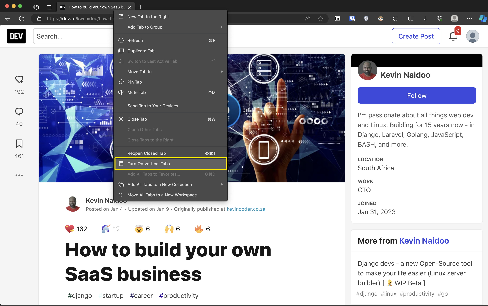

Are you looking for a browser that offers a smoother, more efficient, and user-friendly experience? Look no further than Microsoft Edge! Here are just a few reasons why you might want to consider making the switch:

#### 1. Seamless Gmail Integration:

Say goodbye to juggling multiple accounts! With Edge, you can connect your Gmail account directly. Simply create a Microsoft account using your existing Gmail address, and you'll be able to access your bookmarks and browsing history seamlessly across all your devices.

##### Effortless Bookmark Migration:

No need to manually transfer your favorite bookmarks from Chrome. Edge offers an easy import tool that lets you transfer your bookmarks from another browser in just a few clicks. Simply export your bookmarks from Chrome, import the file into Edge, and voila! Your bookmarks are ready to go.

#### 2. Vertical Tabs for Enhanced Organization:

Tired of cluttered horizontal tabs? Edge offers a vertical tab view, making it easier to navigate through numerous open tabs and find the one you need quickly. This innovative feature provides a clear visual overview and streamlines your browsing experience.

#### 3. Read Aloud: Listen to Your Content:

Edge's built-in `Read Aloud feature` allows you to have web pages read aloud to you in a natural voice. This is a fantastic option for those who prefer to consume information audibly or struggle with reading fatigue.

#### 4. Boost Your Efficiency with Keyboard Shortcuts:

Edge empowers you to switch between your two most recently used tabs with a single keyboard shortcut (Command + `). This handy feature saves you time and keeps your workflow focused.

#### Discover a World of Possibilities:

These are just a few of the many features that make Microsoft Edge a compelling choice. From its intuitive interface to its innovative functionalities, Edge offers a powerful and user-friendly way to navigate the web. Why not give it a try and see the difference for yourself?
