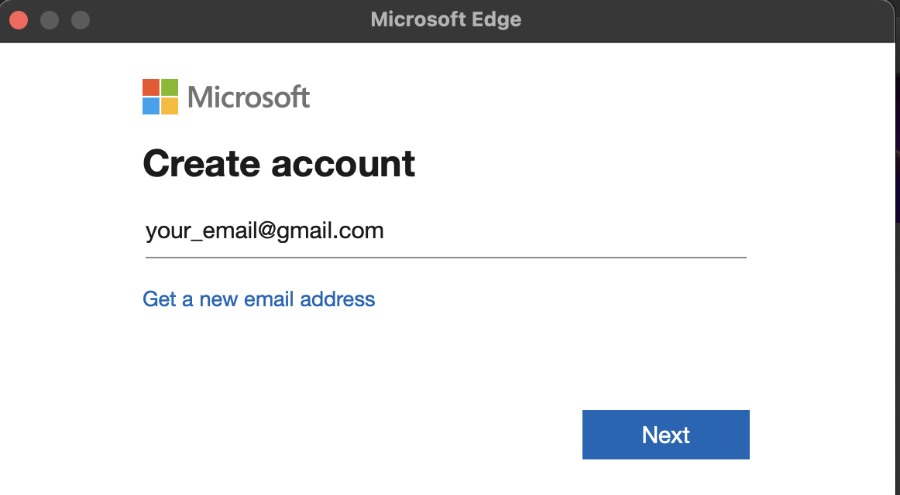

### 1. Read aloud 📣

When I'm lazy reading articles, I normally use this feature. It's quite convenient when you can listen to it while doing other things.  
There are so many Chrome extensions can read for you like this but the voices in Edge is so human-like.

### 2. Vertical tabs

It helps me easily navigate between tabs

### 3. Switch between 2 tabs 🔄

When I want to switch back and forth between 2 tabs, I just need to press Ctrl + ` (in Mac). Sorry I haven't check if it's the same in Windows.

### 4. Sync with Google account

The responses I always receive when I convince someone to switch into Edge is:  
"**Oh I dont have microsoft account and I'm so lazy to create one. I only have Gmail account tho**".  
No problem. You can create an edge account with your gmail easily.

Then I heard something like: "**Oh my bookmarks are all in Chrome. I hate to sync them all here.**"  
No worry. You can export and import them from Chrome to Edge only once. You can check <a href="https://support.google.com/chrome/answer/96816?hl=en-GB" target="\_blank">
the instructions here </a> for details.  
From now on, those bookmarks will stick to your edge/microsoft account wherever you log in.

And about extensions, I believe sync them also easy since both Chrome and Edge are Chromium-based browsers.

### Conclusion

There are more wonderful features that I can't list them all here. But believe me, once you switch to Edge, you won't regret!
