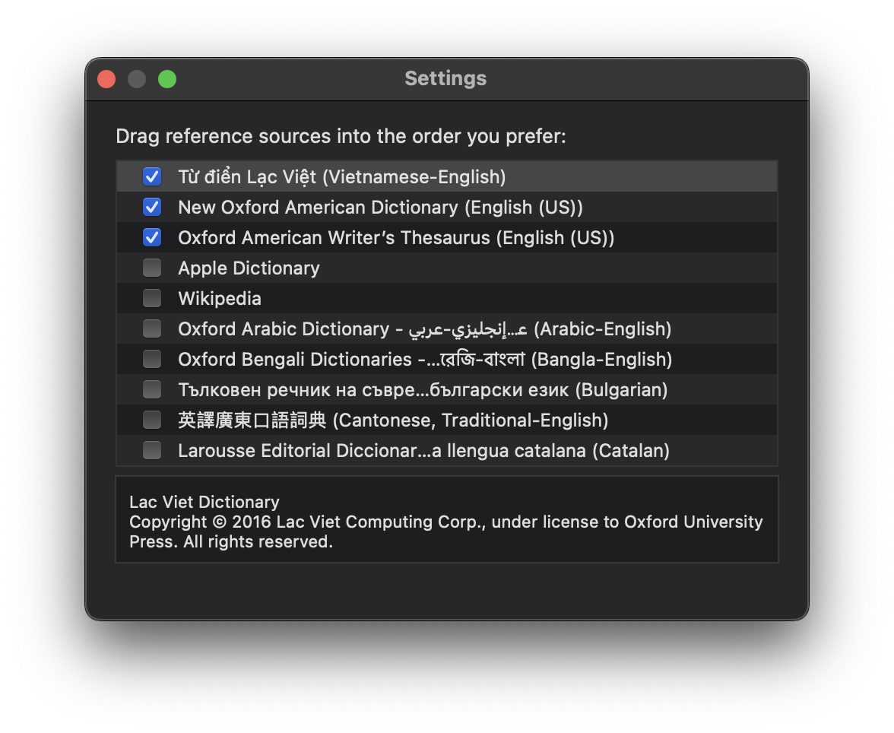
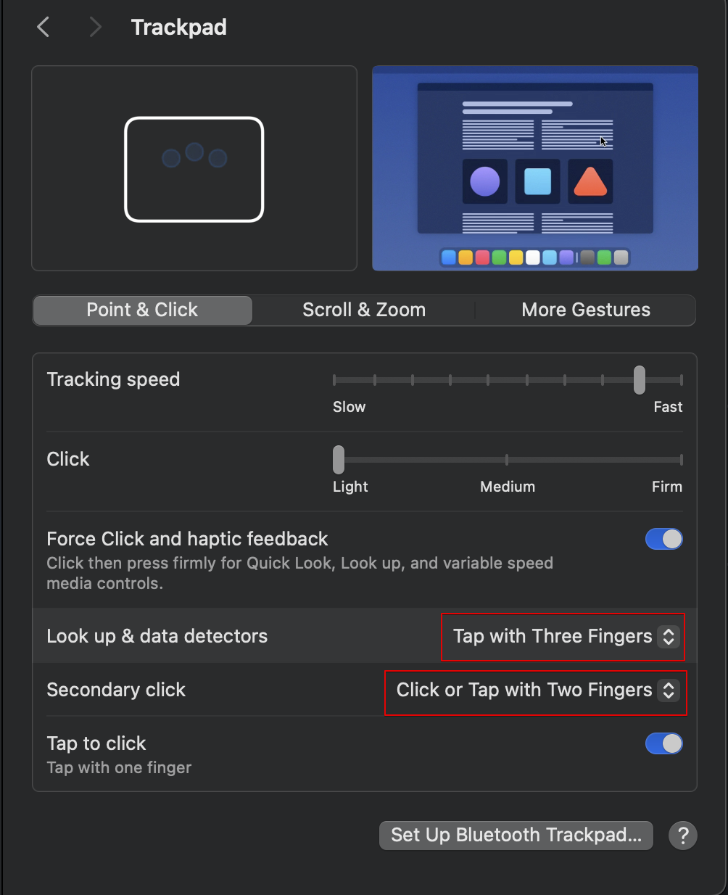
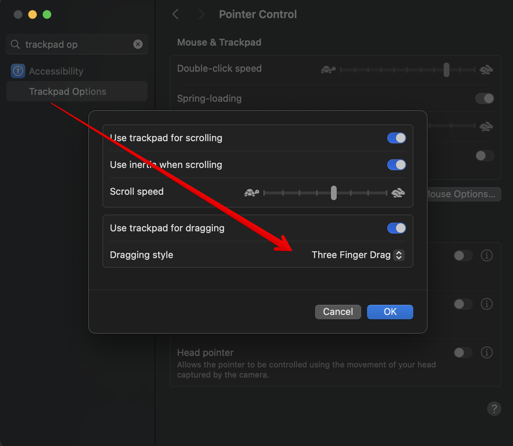

Today, I'll show you how I setup some useful stuff for a new Mac

## Dictionary

English is not my native language so I always use Lac Viet dictionary as my first lookup.  
It's also more convenient when you set `three finger tap` to popup word's meaning at below section.


## Mouse and Trackpad

Below setup is quite useful but some people who are new to Mac might leave out:

- Three fingers tap for lookup & secondary click with two fingers
  
- Drag with three fingers
  

## Installations

### 1. Finder configurations

```bash
# Set nohidden Library/
chflags nohidden ~/Library

# Show hidden files
defaults write com.apple.finder AppleShowAllFiles YES

# Show path bar
defaults write com.apple.finder ShowPathbar -bool true

# Disable hold button show special characters
defaults write -g ApplePressAndHoldEnabled -bool false

# Restart Finder
killall Finder;
```

<br />

### 2. Terminal

```bash
# Install Homebrew https://brew.sh/
/bin/bash -c "$(curl -fsSL https://raw.githubusercontent.com/Homebrew/install/HEAD/install.sh)"

brew update
```

<br />

### 3. App installations

```bash
brew install --cask \
  bitwarden \
  google-chrome  \
  microsoft-edge \
  iterm2 \
  visual-studio-code \
  cursor \
  docker \
  orbstack \
  spectacle \
  slack \
  discord \
  vlc \
  iina \
  calibre \
  figma \
  raycast \
  protonvpn \
  zoom \
  ticktick \
  dbeaver-community \
  postman \
  spotify \
  obsidian \
  telegram \
  openkey \
  the-unarchiver \
  folx \
  steam \
  notion \
  stats \
  sioyek \
-f

```

<br />

### 4. Libs installations

```bash
brew install \
  python \
  pipx \
  go \
  postgresql \
  zsh \
  wget \
  git \
  nvm \
  pnpm \
  node \
  thefuck \
  zoxide \
  tldr \
  exa \
  duf \
  aria2 \
  bat \
  diff-so-fancy \
  fzf \
  ripgrep \
  bandwhich \
  bpytop \
  lazydocker \
  ffmpeg \
-f

```

<br />

### 5. Others

```bash
# Fira code font https://github.com/tonsky/FiraCode/wiki/Installing
brew tap homebrew/cask-fonts
brew install --cask font-fira-code

# Oh My Zsh https://ohmyz.sh/#install
sh -c "$(curl -fsSL https://raw.githubusercontent.com/ohmyzsh/ohmyzsh/master/tools/install.sh)"

# Powerlevel10k https://github.com/romkatv/powerlevel10k?tab=readme-ov-file#oh-my-zsh
git clone --depth=1 https://github.com/romkatv/powerlevel10k.git ${ZSH_CUSTOM:-$HOME/.oh-my-zsh/custom}/themes/powerlevel10k
# Set ZSH_THEME="powerlevel10k/powerlevel10k" in ~/.zshrc
```

#### References:

https://www.taniarascia.com/setting-up-a-brand-new-mac-for-development/  
https://www.robinwieruch.de/mac-setup-web-development/  
https://github.com/mathiasbynens/dotfiles/blob/master/.macos
